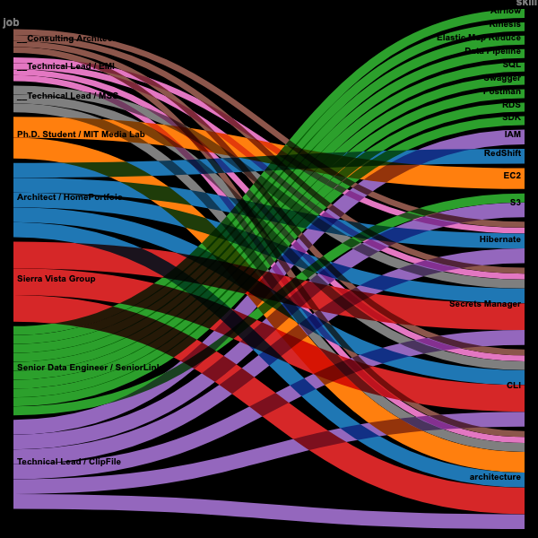

# Creating my own skills-jobs chart using RAWgraphs.io

[RAWGraphs](https://www.rawgraphs.io/) is a free and open source tool for data visualization.

Check out their [gallery of options](https://www.rawgraphs.io/gallery)

This project shows how I created my own "Alluvial" graph using a matrix of my jobs, skills, and number of years at each job.

I started by creating a [job-skills-years.xlsx](job-skills-years.xlsx) MSExcel spreadsheet with the following features:  

Rows:  
row 1 shows "Professional Experience" or jobs  
row 2 is the number of "years" at each job  
rows 3 to 5 are visuals  
row 6 shows the year of each job  

Columns:  
col 1 shows "Technical Skills" or "skills"  
each col after 'C' or 3, show skills for a job  
'x' indicates a skill for a given job in a given year  

## Create the dense job-skills-years matrix  

The [rawgraph_from_excel.py](rawgraph_from_excel.py) python module loads the job-skills-years.xlsx file into a Pandas DataFrame.

All skill-row, job-column, and year-cells marked with 'x' are used to create \(skill-job-year\) tuplets, which are stored as rows in a local [dense.csv](dense.csv).

## Create the dense job-skills-years graphic  

To create an Alluvial graph from this csv file of tuplets, open the 
[RAWgraphs 2.0 beta](https://app.rawgraphs.io/)
creator page

1. Load your data - Upload your data - choose the local "dense.csv" file  
2. Choose a chart - choose "Alluvial"  
3. Mapping - drop "job" and "skill" Dimensions into  Steps, and "years" into Size  
4. Customize - make no changes
5. Export - download the resulting graph as a png file.

The resulting graphic is quite dense and the text is unreadable. 
So I needed to take steps to reduce its density.

## Reduce matrix density by "uniquification"  

The code reduces the density of the job-skills-year matrix by normalizing job values 
and keeping only selected rows before dropping duplicate rows. This is done in the following steps:  
1. normalize job values (remove trailing digit suffix)
2. keep only skill rows that have more than 1 non-NaN job value  
3. keep only skill rows with years > 1  
4. keep only skill rows that start with '_'  
5. drop duplicate rows  

The resulting "uniquified" matrix is saved to "uniques.csv".

## See the effects of "uniquification"  

Re-open the [RAWgraphs 2.0 beta](https://app.rawgraphs.io/) creator page.  

Choose get started  
1. Load your data  
   - "Upload your data" - choose the local "uniques.csv" file  
2. Choose a chart  
   - choose "Alluvial"  
3. Mapping  
   - drag "job" and "skill" dimensions into Steps  
   - drag "years" into Size  
4. Customize  
   - set the width and height to 600  
5. Export  
   - export the results as "uniques-600x600.svn"  
   - export the results as "uniques-600x600.png"  




Open your browser window to view [uniques-600x600.png](./uniques-600x600.png))

## Prepare for color adjustments  

### Step 1  The `jobs-color-palette`  

The `jobs-color palette`is found in the `style` section of the `ribbons.html` 
file starting at around line 20.  There is a `stroke` color value and a 
stroke `hover` color value that will be used for all of the `path` elements 
for each `job`.

```
      .seniorlink { stroke: #2ca02c; }
      .seniorlink:hover { stroke: white; }

      .clipfile { stroke: #8fbd67; }
      .clipfile:hover { stroke: white; }

      ... and so on ...
```

Notice that all `hover` psuedo-classes currently use `white`.


### Step 2  Insert the `svg` file into the `ribbons.html file`

Copy the contents of the `uniques-600x600.svg` and insert it into `ribbons.html' 
between the commented lines `FROM HERE ...` and `... TO HERE`


### Step 3 Add `path` class tags  

* Search for a `g-block` that starts with a `g-line` with this value `<g style="mix-blend-mode: multiply;">`  

```
    <g style="mix-blend-mode: multiply;">                             <!-- a g-line -->
        <path d="M5,358.79139072847676C290,358.
            79139072847676,290,4.                                     <!-- a path-line -->
            966887417218543,575,4.966887417218543" 
            stroke-width="9.933774834437086"
            style="--darkreader-inline-stroke: #67d567;" 
            data-darkreader-inline-stroke=""/>
        <title>Senior Data Engineer / SeniorLink → Airflow: 3</title> <!-- a title line -->
    </g>
```

* The `path-line` is the line under the `g-line` that begins with a `path` tag.  
* The `title-line` is the line under the `class-line` that begins with a `title` tag.  
* The contents of the `title-line` has format `role` and `job`.  
* Use the `job` value to add a `class` tag to the `path-line` referring to the `job-class-pallet`.  
* If `job` is "SeniorLink", then add `class="seniorlink"` after the `path` tag and before the next `d` tag on the `path-line`.  

If done properly, the updated `g-block` will be this:

```
    <g style="mix-blend-mode: multiply;"> 
        <path class="seniorlink" d="M5,358.
            79139072847676C290,358.79139072847676,290,4. 
            966887417218543,575,4.966887417218543" 
            stroke-width="9.933774834437086"
            style="--darkreader-inline-stroke: #67d567;" 
            data-darkreader-inline-stroke=""/>
        <title>Senior Data Engineer / SeniorLink → Airflow: 3</title>
    </g>
```

Continue adding `class` tags to `g-blocks`.   
On last count there were a total of 37 such lines.  

### Step 4.  

Now open `ribbons.html` in a browser window, to verify that it has the 
same `ribbons` as those found in the original `uniques-600x600.svg` file.
Also verify that the ribbon colors change on mouse hover.  


## Make color adjustments  

Now we're ready to adjust the `jobs-color-palette`.  Simplly edit color values 
for each job class and refresh the browser page to see the results.

## Backlog

* Remove the "job" and "skill" headers

* Remove the double underscores from the job text labels.

* Text labels should be aligned to abutt against the edge of 
the ribbons box with the rest fallling outside.

* The verticle bar colors are randomly white and black. They 
should have the same color as its ribbon and should have a 
hz gap that separates it from its ribbon.

* The job boxes shown on the jobs page should match the 
colors in the ribbons box.


