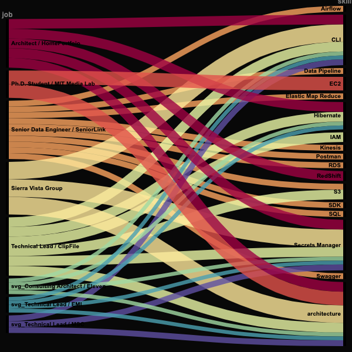

# Creating my own  job-skills RAWGraph

[RAWGraphs](https://www.rawgraphs.io/) is a free and open source tool for data visualization.

Check out their [gallery of options](https://www.rawgraphs.io/gallery)

This project shows how I created my own "Alluvial" graph using a matrix of my jobs and skills, and number of years at each job.

I started by creating a [job-skills.xlsx](job-skills.xlsx) MSExcel spreadsheet with the following features:  

Rows:  

* row 1 shows "Professional Experiences" or "jobs"  
* row 2 is the number of years at each job  
* rows 4 to 6 are color-coded visual helpers  
* row 7 shows the year of each job  

Columns:  

* col A shows "Technical Skills" or "skills"  
* col B is the computed years of experience for each skill
* cols between C and AK show skills for a job  
'x' indicates a skill for a given job in a given year  

* cols after AK associate skills with "Skill Categories",
but these are not used at this time.

## Generate the `job-skills-rawgraph.csv` file  

The `rawgraph_csv_from_excel.py` Python script
reads the contents of the `job-skills.xlsx` spreadsheet
into a Pandas dataframe.

The following rules are applied keep only the data
used to generate the rawgraph:

1. keep only columns between C and AK
2. keep only rows >= 9  
3. keep only rows with B > 1
4. keep only skill rows prefixed with '_'  
5. drop duplicate rows  

The reduced dataframe is saved to "job-skills-rawgraph.csv".

## Create the rawgraph

Open your browser to the [RAWgraphs 2.0 beta](https://app.rawgraphs.io/) creator page.  

Choose get started  

1. Load your data  
   * "Upload your data" - choose the local "job-skills-rawgrap.csv" file  
2. Choose a chart  
   * choose "Alluvial"  
3. Mapping  
   * drag "job" and "skill" dimensions into Steps  
   * drag "years" into Size  
4. Customize (feel free to experiment!!)
   * Width: 600
   * Height: 600  
   * Background: #000000
   * Margins: 10
   * Nodes width: 5
   * Padding: 5
   * Links opacity: 0.8
   * Links blend mode: normal
   * Sort nodes by: Name
   * Rows alignment: Center
   * Color scale: Ordinal
   * Color schema: Spectral discrete
   * Show nodes values: No
5. Export  
   * export the results as "job-skills-600x600.svn"  
   * export the results as "job-skills-600x600.png"  

Open your browser window to see the newly generated [job-skills-600x600.svg](./job-skills-600x600.svg)) file.



## Prepare the svg file for color adjustments  

### Step 1  The `jobs-color-palette`  

The `jobs-color palette`is found in the `style` section of the `job-skills.html`
file starting at around line 20.  There is a `stroke` color value and a
stroke `hover` color value that will be used for all of the `path` elements
for each `job`.

``` html
      .seniorlink {
        stroke: rgb(251, 163, 94);
      }
      .seniorlink:hover {
        stroke: white;
      }
      .clipfile {
        stroke: rgb(235, 247, 166);
      }
      .clipfile:hover {
        stroke: white;
      }
      ... and so on ...
```

Notice that all `hover` psuedo-classes currently use `white`.

### Step 2  Insert the `svg` file into the `job-skills.html` file

Copy the contents of the `job-skills-600x600.svg` and insert it into `job-skills.html'
between the commented lines`FROM HERE ...` and `... TO HERE`.

### Step 3  Apply the formatter  

To make the updated `job-skills.html` file more readable, use `shift-command-p`
(on macos) to open the command pallete,  select "Format Document With...",
and choose "Prettier Code Formatter (default)" or "HTML Language Features",
whichever you prefer.

### Step 4 Add `path` class tags and remove `stroke` properties  

* Search for a `g-block` that starts with a `g-line` that looks something like this, `<g style="mix-blend-mode: normal;">`  

``` html
    <g style="mix-blend-mode: normal">                                  <!-- g-line -->
        <path d="M5,358.79139072847676C290,358.
            79139072847676,290,4.                                       <!-- path-line -->
            966887417218543,575,4.966887417218543" 
            stroke=rgb(251, 163, 94)                                    <!-- stroke-property -->
            stroke-width="9.933774834437086"
            style="--darkreader-inline-stroke: #67d567;" 
            data-darkreader-inline-stroke=""/>
        <title>Senior Data Engineer / SeniorLink → Airflow: 3</title>   <!-- title line -->
    </g>
```

* The `path-line` is the line under the `g-line` that begins with a `path` tag.  
* The `title-line` is the line under the `class-line` that begins with a `title` tag.  
* The contents of the `title-line` has format `role` and `job`.  
* Use the `job` value to add a `class` tag to the `path-line` referring to the `job-class-pallet`.  
* For example, if `job` is "SeniorLink", then add `class="seniorlink"` after the `path` tag and before the next `d` tag on the `path-line`.  
* Finally, remove the `stroke-property`, since it will be overriden by the `jobs-color palette`.

If done properly, the updated `g-block` will be this:

``` html
    <g style="mix-blend-mode: normal;"> 
        <path class="seniorlink" d="M5,358.
            79139072847676C290,358.79139072847676,290,4. 
            966887417218543,575,4.966887417218543" 
            stroke-width="9.933774834437086"
            style="--darkreader-inline-stroke: #67d567;" 
            data-darkreader-inline-stroke=""/>
        <title>Senior Data Engineer / SeniorLink → Airflow: 3</title>
    </g>
```

Continue adding `class` tags and removing `stroke` properties to the remaining
`g-blocks`.  On last count there was a total of 37 `g-blocks`.

### Step 5  

If you're viewing this from github download the
[[`job-skills.html`](./job-skills.html)] to your local machine and open it in a new browser window.  

Verify that it has the same ribbon structure as that found in the original `job-skills-600x600.svg` file.  

Also verify that the ribbon colors change on mouse hover.  

## Make color adjustments  

Now we're ready to adjust the `jobs-color-palette`.  Simplly edit color values
for each job class and refresh the browser page to see the results.

## Backlog

* Remove the "job" and "skill" headers.

* Text labels should be white not black and aligned to abutt
  against the outside edges of the job-skills box with the rest of
  the text falling outside.

* Verticle node bars are currently black, but they should have
  the ribbon color with padding outside of each ribbon end.

* Related: the job boxes shown on the jobs page should match the
  colors in the job-skills box.
