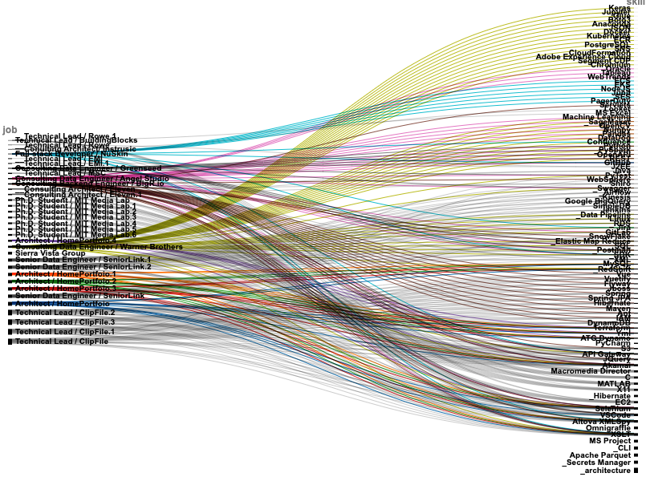
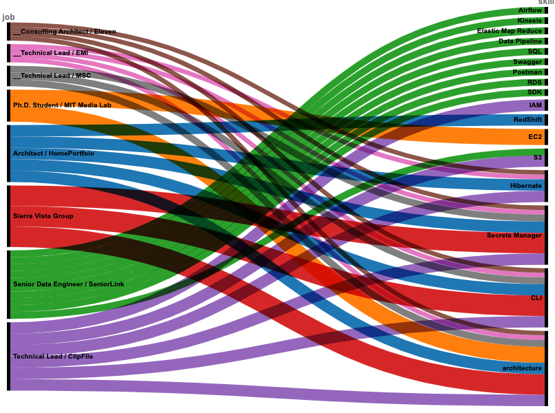
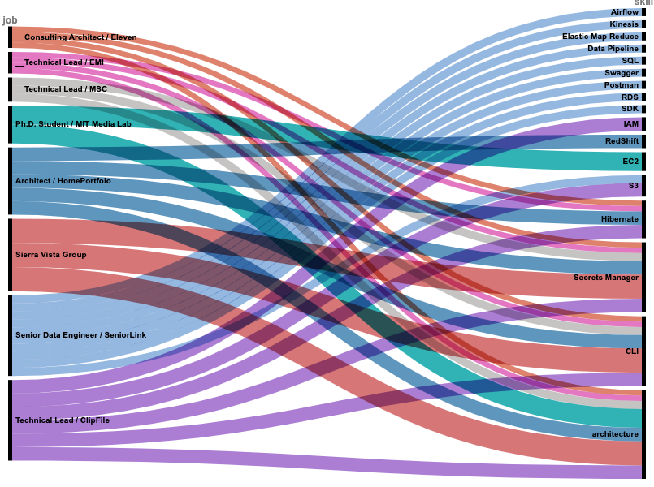

# Creating my own skills-jobs chart using RAWgraphs.io

[RAWGraphs](https://www.rawgraphs.io/) is a free and open source tool for data visualization.

Check out their [gallery of options](https://www.rawgraphs.io/gallery)

This project shows how I created my own "Alluvial" graph using a matrix of my jobs, skills, and number of years at each job.

I started by creating a [job-skills-years.xlsx](job-skills-years.xlsx) MSExcel spreadsheet with the following features:  

Rows:  
row 1 shows "Professional Experience" or jobs  
row 2 is the number of "years" at each job  
rows 3 to 5 are visuals  
row 6 shows the year of each job  

Columns:  
col 1 shows "Technical Skills" or "skills"  
each col after 'C' or 3, show skills for a job  
'x' indicates a skill for a given job in a given year  

## Create the dense job-skills-years matrix  

The [rawgraph_from_excel.py](rawgraph_from_excel.py) python module loads the job-skills-years.xlsx file into a Pandas DataFrame.

All skill-row, job-column, and year-cells marked with 'x' are used to create \(skill-job-year\) tuplets, which are stored as rows in a local [dense.csv](dense.csv).

## Create the dense job-skills-years graphic  

To create an Alluvial graph from this csv file of tuplets, open the 
[RAWgraphs 2.0 beta](https://app.rawgraphs.io/)
creator page

1. Load your data - Upload your data - choose the local "dense.csv" file  
2. Choose a chart - choose "Alluvial"  
3. Mapping - drop "job" and "skill" Dimensions into  Steps, and "years" into Size  
4. Customize - make no changes
5. Export - download the resulting graph as a png file.

Notice that the resulting graphic is quite dense and the text is unreadable.

## Reduce matrix density by "uniquification"  

The code reduces the density of the job-skills-year matrix by normalizing job values and keeping only selected rows before dropping duplicate rows. This is done in the following steps:  
1. normalize job values (remove trailing digit suffix)
2. keep only skill rows that have more than 1 non-NaN job value  
3. keep only skill rows with years > 1  
4. keep only skill rows that start with '_'  
5. drop duplicate rows  

The resulting "uniquified" matrix is saved to "uniques.csv".

## See the effects of "uniquification" 

Re-open the [RAWgraphs 2.0 beta](https://app.rawgraphs.io/) creator page.  

Choose get started  
1. Load your data - "Upload your data" - choose the local "uniques.csv" file  
2. Choose a chart - choose "Alluvial"  
3. Mapping - drop "job" and "skill" dimensions into Steps, and "years" into Size  
4. Customize - shows the greatly simplified alluvial graphic created for the "uniques.csv" file  
5. Export - export the resulting graphic as "uniques.png"  

## Revise the color pallet  

The uniquified result is less dense, and the text is now readable, but the colors are a bit harsh. To soften the color palette, open the Colors section, under Customize and change the RGB value of each job to make them more pastel.

Save the graphic as "pastels.png"   

## Save and reload the project  

Save the project as "pastels.rawgraphs"

Close the browser window and reopen [RAWgraphs 2.0 beta](https://app.rawgraphs.io/)

In section 1 Load your data, choose "Open your project" 
and select the "pastels.rawgraphs" file to verify that the project was saved and then loaded correctly.

